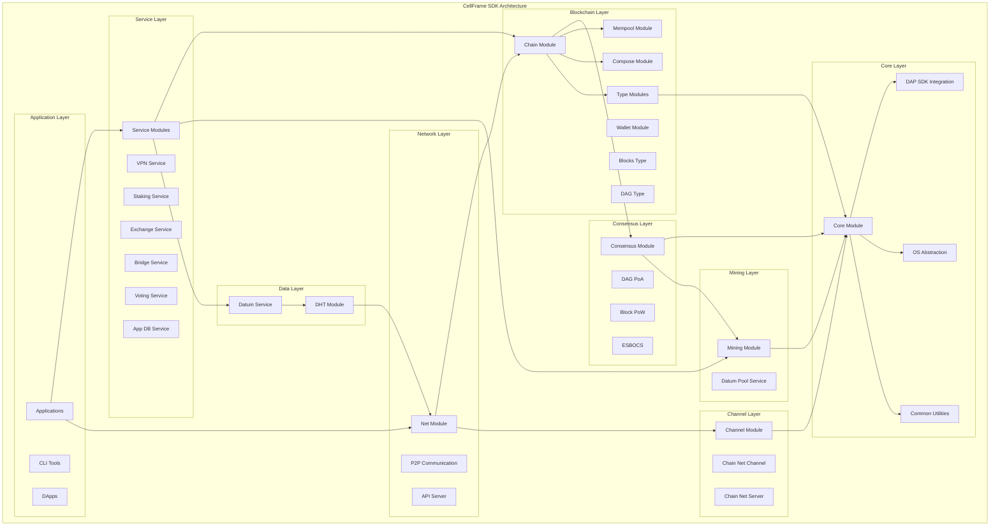
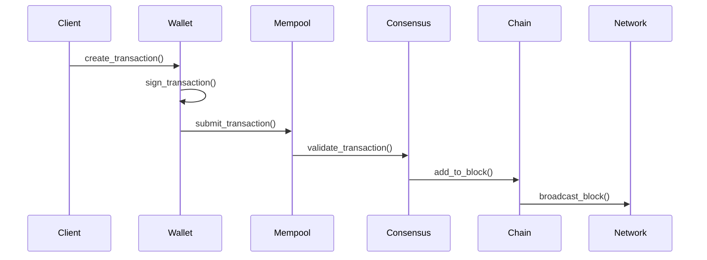
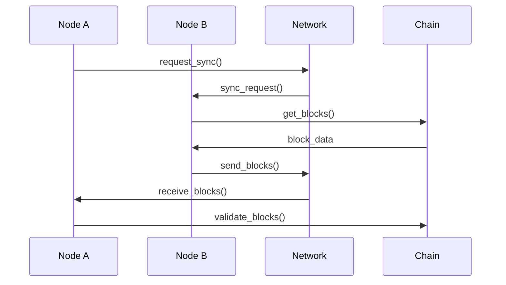
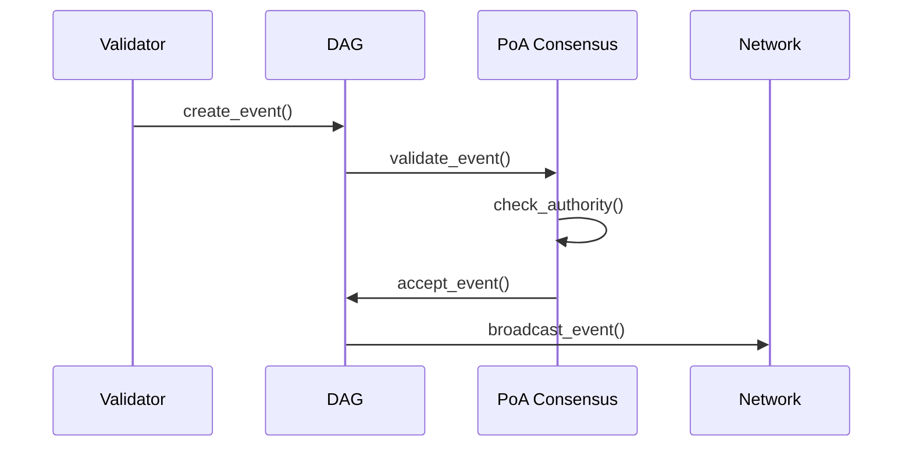

# Архитектура CellFrame SDK

## Обзор архитектуры

CellFrame SDK построен на модульной архитектуре, где каждый модуль отвечает за определенную функциональность блокчейн-системы. Архитектура обеспечивает высокую масштабируемость, гибкость и безопасность.

## Диаграмма архитектуры



## Основные компоненты

### 1. Core Module (Ядро)

**Назначение**: Базовая функциональность и интеграция с DAP SDK

**Ключевые компоненты**:
- Интеграция с DAP SDK
- Общие утилиты и структуры данных
- Платформо-специфичные реализации
- Управление жизненным циклом модулей

### 1.1. OS Layer (Абстракция ОС)

**Назначение**: Кроссплатформенная абстракция операционной системы

**Ключевые компоненты**:
- `os/win32/` - Windows-специфичная реализация
- Системные вызовы и API
- Платформо-зависимые утилиты

**Функциональность**:
- Абстракция файловой системы
- Управление процессами
- Сетевые интерфейсы ОС
- Системные ресурсы

### 2. Chain Module (Блокчейн цепочка)

**Назначение**: Основная логика блокчейн цепочки

**Ключевые компоненты**:

#### Структура данных
```c
// Основная структура цепочки (ИСПРАВЛЕНО: реальная структура из кода)
typedef struct dap_chain {
    pthread_rwlock_t rwlock;           // Common rwlock for the whole structure
    dap_chain_id_t id;                 // Идентификатор цепочки
    dap_chain_net_id_t net_id;         // ID сети (не указатель на структуру)
    uint16_t load_priority;            // Приоритет загрузки
    char *name;                        // Имя цепочки
    char *net_name;                    // Имя сети
    bool is_datum_pool_proc;           // Флаг обработки пула данных
    bool is_mapped;                    // Флаг маппинга
    atomic_int load_progress;          // Прогресс загрузки
    // Nested cells (hashtab by cell_id)
    dap_chain_cell_t *cells;           // Ячейки цепочки (НЕ ledger!)
    dap_chain_cell_id_t active_cell_id; // Активная ячейка
    dap_chain_cell_id_t forking_cell_id; // Форкинговая ячейка

    uint16_t datum_types_count;        // Количество типов данных
    dap_chain_type_t *datum_types;     // Типы данных
    uint16_t default_datum_types_count; // Количество типов по умолчанию
    dap_chain_type_t *default_datum_types; // Типы по умолчанию
    uint16_t autoproc_datum_types_count; // Автообработка типов
    uint16_t *autoproc_datum_types;    // Автообработка типов
    uint64_t atom_num_last;            // Последний номер атома
    dap_time_t blockchain_time;        // Время блокчейна

    dap_chain_sync_state_t state;      // Состояние синхронизации

    uint16_t authorized_nodes_count;   // Количество авторизованных узлов
    dap_stream_node_addr_t *authorized_nodes_addrs; // Адреса авторизованных узлов

    // 20+ callback функций для различных операций
    // ... (полный список в исходном коде)

    void *_pvt;                        // Приватные данные
    void *_inheritor;                  // Наследуемые данные
} dap_chain_t;

// Атомарный элемент (транзакция/блок)
typedef struct dap_chain_atom {
    dap_chain_atom_type_t type;   // Тип атома
    void *data;                   // Данные
    size_t data_size;             // Размер данных
    // ...
} dap_chain_atom_t;
```

#### DAG структура
```c
// DAG элемент
typedef struct dap_chain_dag_element {
    dap_chain_hash_t hash;        // Хеш элемента
    dap_chain_hash_t *prev_hashes; // Предыдущие хеши
    void *data;                   // Данные
    // ...
} dap_chain_dag_element_t;
```

### 3. Wallet Module (Кошелек)

**Назначение**: Управление криптовалютными кошельками и ключами

**Функциональность**:
- Генерация и управление ключами
- Подписание транзакций
- Управление балансами
- Мультиподпись (multisig)

```c
// Структура кошелька (ИСПРАВЛЕНО: реальная структура из кода)
typedef struct dap_chain_wallet{
    char        name[ DAP_WALLET$SZ_NAME + 1 ];  // Human readable name of BMF Wallet (фиксированный размер!)
    uint64_t    flags;                           // See DAP_WALLET$M_FL_* constants (флаги вместо addr/key полей)
    void        *_internal;                      // Внутренние данные (не addr!)
    void        *_inheritor;                     // Наследуемые данные (не key!)
} dap_chain_wallet_t;
```

### 4. Net Module (Сеть)

**Назначение**: Сетевая коммуникация и пиринг

**Ключевые компоненты**:
- P2P сеть
- HTTP/JSON-RPC API
- Управление соединениями
- Синхронизация данных

```c
// Структура сети
typedef struct dap_chain_net {
    char *name;                   // Имя сети
    dap_chain_net_id_t id;        // ID сети
    dap_chain_node_list_t *nodes; // Список узлов
    // ...
} dap_chain_net_t;
```

### 5. Consensus Module (Консенсус)

**Назначение**: Алгоритмы достижения консенсуса

#### Поддерживаемые алгоритмы

##### DAG PoA (Proof of Authority)
```c
typedef struct dap_chain_cs_dag_poa {
    dap_chain_cs_dag_t *dag;      // DAG структура
    dap_list_t *validators;       // Список валидаторов
    // ...
} dap_chain_cs_dag_poa_t;
```

##### Block PoW (Proof of Work)
```c
typedef struct dap_chain_cs_block_pow {
    uint32_t difficulty;          // Сложность
    dap_hash_t *target;           // Цель
    // ...
} dap_chain_cs_block_pow_t;
```

##### ESBOCS (Enhanced Scalable Blockchain Consensus)
```c
typedef struct dap_chain_cs_esbocs {
    uint32_t epoch;              // Эпоха
    dap_list_t *committees;      // Комитеты
    // ...
} dap_chain_cs_esbocs_t;
```

### 6. Service Modules (Сервисные модули)

**Назначение**: Дополнительные сервисы платформы

#### VPN Service
```c
typedef struct dap_chain_net_srv_vpn {
    dap_chain_net_t *net;         // Сеть
    void *vpn_context;            // VPN контекст
    // ...
} dap_chain_net_srv_vpn_t;
```

#### Staking Service
```c
typedef struct dap_chain_net_srv_stake {
    dap_chain_addr_t *validator_addr; // Адрес валидатора
    uint256_t stake_amount;       // Сумма стейка
    // ...
} dap_chain_net_srv_stake_t;
```

### 6.1. Channel Module (Каналы коммуникации)

**Назначение**: Управление коммуникационными каналами

**Ключевые компоненты**:
- `channel/chain-net/` - Сетевой канал цепочки
- `channel/chain-net-srv/` - Сервер сетевого канала

**Функциональность**:
- Установление соединений
- Маршрутизация сообщений
- Управление каналами
- Протоколы коммуникации

### 6.2. Mining Module (Майнинг)

**Назначение**: Доказательство работы и майнинг

**Ключевые компоненты**:
- `mining/` - Основной модуль майнинга
- `service/mining-pool/` - Сервис майнинг-пулов

**Функциональность**:
- Поиск nonce
- Валидация proof-of-work
- Управление майнинг-пулами
- Распределение вознаграждений

### 6.3. DHT Module (Распределенная хеш-таблица)

**Назначение**: P2P обнаружение узлов и данных

**Ключевые компоненты**:
- `dht/` - Основной DHT модуль

**Функциональность**:
- Хранение ключ-значение
- Обнаружение пиров
- Маршрутизация запросов
- Репликация данных

### 6.4. Mempool Module (Пул транзакций)

**Назначение**: Управление неподтвержденными транзакциями

**Ключевые компоненты**:
- `mempool/` - Основной модуль mempool

**Функциональность**:
- Хранение транзакций
- Приоритизация транзакций
- Удаление конфликтующих транзакций
- Лимиты размера

### 6.5. Type Modules (Типы блокчейнов)

**Назначение**: Различные структуры блокчейн данных

**Ключевые компоненты**:
- `type/blocks/` - Блочная структура
- `type/dag/` - DAG структура
- `type/none/` - Отсутствие структуры

**Функциональность**:
- Определение структуры цепочки
- Валидация элементов
- Связи между элементами
- Консенсусные правила

### 6.6. Дополнительные сервисы

#### Voting Service (Голосование)
```c
typedef struct dap_chain_net_srv_voting {
    dap_chain_t *chain;              // Цепочка
    void *voting_context;            // Контекст голосования
    // ...
} dap_chain_net_srv_voting_t;
```

#### App DB Service (База данных приложений)
```c
typedef struct dap_chain_net_srv_app_db {
    void *db_context;                // Контекст БД
    dap_list_t *applications;        // Список приложений
    // ...
} dap_chain_net_srv_app_db_t;
```

#### Datum Service (Управление данными)
```c
typedef struct dap_chain_net_srv_datum {
    void *datum_context;             // Контекст данных
    dap_hash_t *datum_hash;          // Хеш данных
    // ...
} dap_chain_net_srv_datum_t;
```

## Потоки данных

### 1. Создание и обработка транзакций



### 2. Синхронизация сети



### 3. Консенсус DAG PoA



## Система сборки

### Модульная конфигурация

```cmake
# Базовые модули (обязательные)
if (CELLFRAME_MODULES MATCHES "core")
    add_subdirectory(common)
endif()

# Основные компоненты
if (CELLFRAME_MODULES MATCHES "chains")
    add_subdirectory(chain)
    add_subdirectory(wallet)
endif()

# Консенсус (выбирается один или несколько)
if (CELLFRAME_MODULES MATCHES "cs-dag-poa")
    add_subdirectory(consensus/dag-poa)
endif()

# Сервисы (опциональные)
if (CELLFRAME_MODULES MATCHES "srv-vpn")
    add_subdirectory(service/vpn)
endif()
```

### Зависимости модулей

```cmake
# Chain зависит от Core
target_link_libraries(dap_chain dap_core)

# Net зависит от Chain
target_link_libraries(dap_chain_net dap_chain)

# Consensus зависит от Chain
target_link_libraries(dap_chain_cs_dag_poa dap_chain)

# Services зависят от Net
target_link_libraries(dap_chain_net_srv_vpn dap_chain_net)
```

## Безопасность

### Криптографическая архитектура

CellFrame SDK использует многоуровневую систему безопасности:

1. **Транспортный уровень**: TLS 1.3 с пост-квантовыми KEM
2. **Прикладной уровень**: Цифровые подписи и шифрование
3. **Консенсус уровень**: Криптографические доказательства

### Защита от атак

- **Double spending**: Защита через UTXO модель
- **Sybil attacks**: Экономические барьеры (staking)
- **Eclipse attacks**: P2P сеть с множественными соединениями
- **51% attacks**: Различные алгоритмы консенсуса

## Производительность

### Оптимизации

#### Параллельная обработка
```c
// Многопоточная обработка транзакций
pthread_t threads[THREAD_COUNT];
for (int i = 0; i < THREAD_COUNT; i++) {
    pthread_create(&threads[i], NULL, process_transactions, &thread_data[i]);
}
```

#### Кэширование
```c
// LRU кэш для блоков
typedef struct block_cache {
    dap_chain_hash_t hash;
    dap_chain_block_t *block;
    time_t last_access;
} block_cache_t;
```

#### Оптимизированные структуры данных
- **Hash maps**: Для быстрого поиска транзакций
- **Bloom filters**: Для предварительной фильтрации
- **Merkle trees**: Для эффективной валидации

### Масштабируемость

#### Горизонтальное масштабирование
- **Шардинг**: Разделение сети на сегменты
- **Layer 2 решения**: Off-chain транзакции
- **Side chains**: Параллельные цепочки

#### Вертикальное масштабирование
- **Оптимизированные алгоритмы**: O(1) операции поиска
- **Memory pools**: Переиспользование памяти
- **Zero-copy**: Минимизация копирования данных

## Мониторинг и отладка

### Метрики производительности

```c
// Сбор метрик
typedef struct performance_metrics {
    uint64_t tx_per_second;       // Транзакций в секунду
    uint64_t block_time;          // Время создания блока
    uint64_t network_latency;     // Задержка сети
    uint64_t memory_usage;        // Использование памяти
} performance_metrics_t;
```

### Логирование

```c
// Структурированное логирование
#define LOG_DEBUG(module, fmt, ...) \
    dap_log(L_DEBUG, "[%s] " fmt, module, ##__VA_ARGS__)

#define LOG_ERROR(module, fmt, ...) \
    dap_log(L_ERROR, "[%s] " fmt, module, ##__VA_ARGS__)
```

## Заключение

Архитектура CellFrame SDK обеспечивает высокую гибкость и масштабируемость благодаря модульной структуре. Система поддерживает различные алгоритмы консенсуса и может быть адаптирована под различные сценарии использования - от частных корпоративных сетей до публичных блокчейн-платформ.
