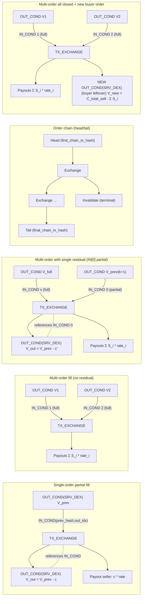
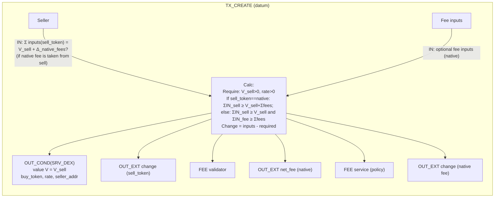
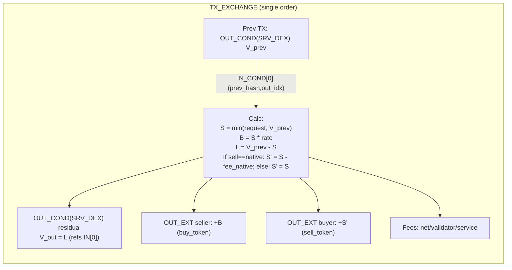
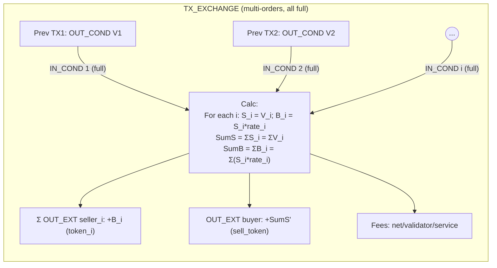
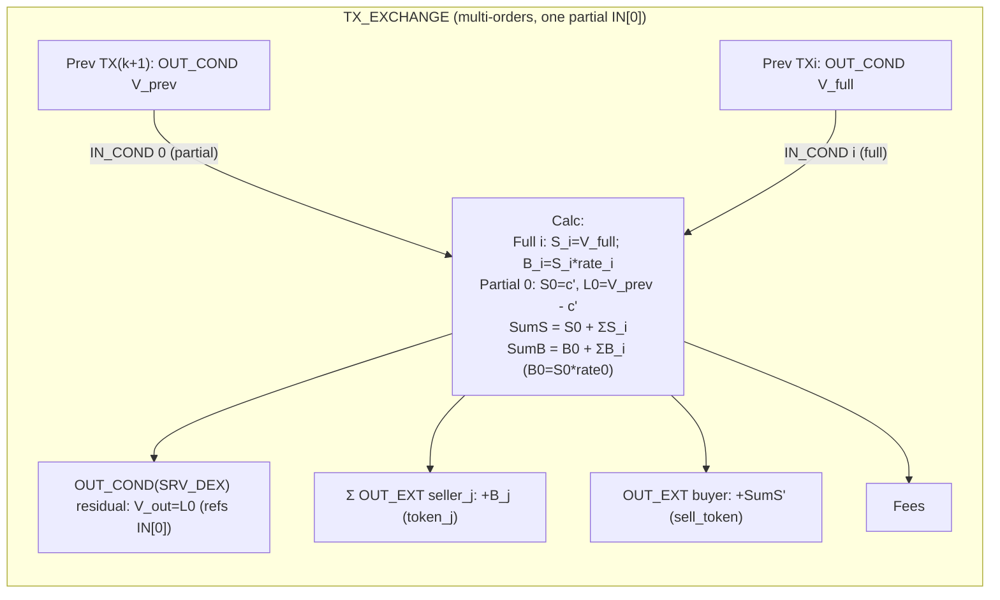
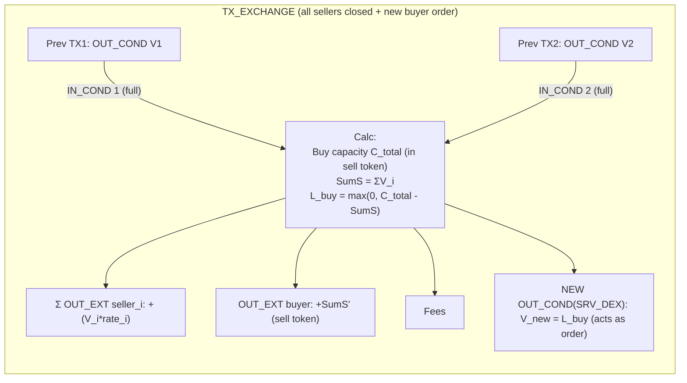
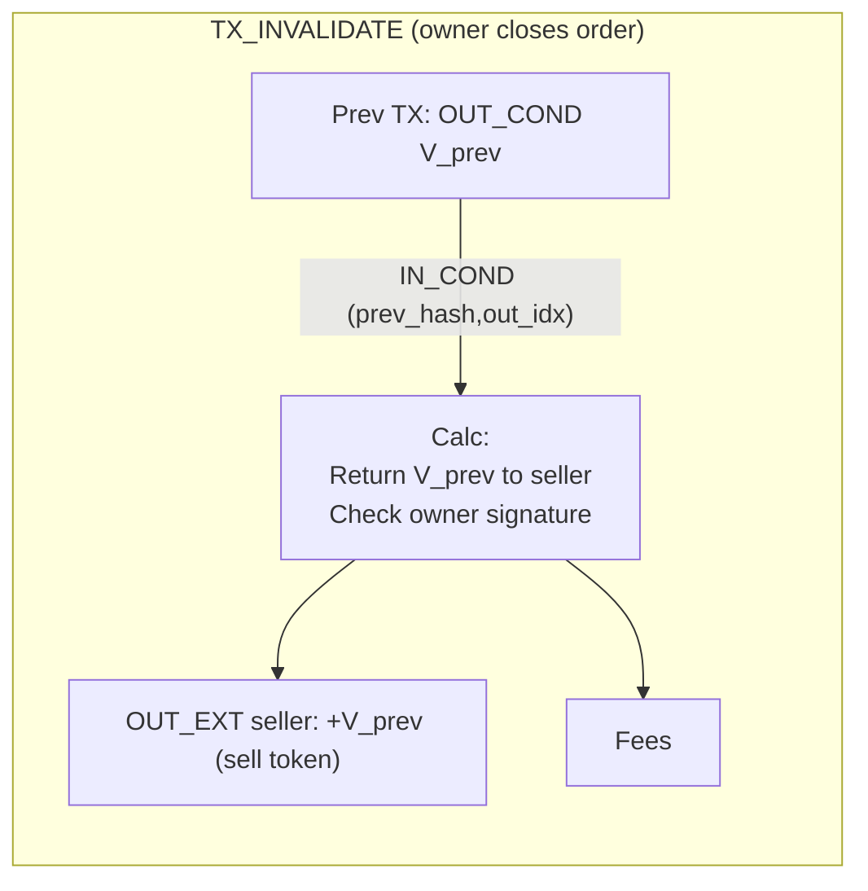

# DEX v2 Diagrams

## Overview



## Transaction Types

```mermaid
flowchart TD

%% ORDER CREATE (seller opens order)
subgraph ORDER_CREATE[Order Create (SRV_DEX)]
  direction TB
  SELLER["Seller"] -- "IN: inputs token_sell (Σ inputs = V_sell + fees)<br/>optional IN for fee token(s)" --> TXO[TX_CREATE]
  TXO --> OUTC["OUT_COND(SRV_DEX) with params:<br/>- value V=V_sell<br/>- buy_token, rate, seller_addr"]
  TXO --> FEES1["Fees outputs: net_fee, validator_fee, service_fee (as policy)"]
  TXO --> CHANGE1["Change back (sell, fee coins) if any"]
end

%% EXCHANGE SINGLE (may be partial)
subgraph EX_SINGLE[Exchange (single order)]
  direction TB
  OC_PREV["Prev OUT_COND: V_prev"] -- "IN_COND[0] (prev_hash,out_idx)" --> TXE[TX_EXCHANGE]
  TXE --> CALC1["Compute: S = min(request, V_prev)<br/>B = S * rate<br/>L = V_prev - S"]
  TXE --> OUT_SELLER["OUT_EXT seller: +B (buy_token)"]
  TXE --> OUT_BUYER["OUT_EXT buyer: +S' (token_sell)<br/>S' may be S or (S - fee_if_native)"]
  TXE --> FEES2["Fees: net/service/validator"]
  L{L > 0?} -->|yes| OUT_RES["OUT_COND(SRV_DEX) residual: V_out=L (refs IN[0])"]
  L -->|no| NORES["No residual OUT_COND"]
end

%% EXCHANGE MULTI (all full)
subgraph EX_MULTI_ALL_FULL[Exchange (multi-orders, all full)]
  direction TB
  O1[OUT_COND V1] -- "IN_COND 1 (full)" --> TXM[TX_EXCHANGE]
  O2[OUT_COND V2] -- "IN_COND 2 (full)" --> TXM
  dots((...)) -- "IN_COND i (full)" --> TXM
  TXM --> CALC2["S_i = V_i; B_i = S_i * rate_i<br/>ΣS = ΣV_i; ΣB = Σ(S_i*rate_i)"]
  TXM --> PAY_SELLERS["Payout sellers: ΣB (per-seller, per-token)"]
  TXM --> PAY_BUYER["Buyer receives ΣS' (sell token)"]
  TXM --> FEES3[Fees]
  TXM --> NORES2["No residual OUT_COND"]
end

%% EXCHANGE MULTI (one partial IN[0])
subgraph EX_MULTI_ONE_PARTIAL[Exchange (multi-orders, one partial IN[0])]
  direction TB
  OP[OUT_COND V_prev(k+1)] -- "IN_COND 0 (partial)" --> TXMP[TX_EXCHANGE]
  OF[OUT_COND V_full] -- "IN_COND i (full)" --> TXMP
  TXMP --> CALC3["For full i: S_i=V_i, B_i=S_i*rate_i<br/>For partial 0: S_0=c', L_0=V_prev - c'<br/>Totals: ΣS, ΣB"]
  TXMP --> PAY_SELLERS2["Payout sellers: ΣB"]
  TXMP --> OUT_RES0["Residual OUT_COND (only one): V_out=L_0 (refs IN[0])"]
  TXMP --> FEES4[Fees]
end

%% EXCHANGE MULTI (all closed + new buyer order)
subgraph EX_MULTI_NEW_BUYER_ORDER[Exchange (all sellers closed, new buyer order)]
  direction TB
  Oa[OUT_COND V1] -- "IN_COND 1 (full)" --> TXB[TX_EXCHANGE]
  Ob[OUT_COND V2] -- "IN_COND 2 (full)" --> TXB
  TXB --> CALC4["Requested buy capacity C_total (in sell token).<br/>Consumed ΣS = ΣV_i.<br/>Buyer leftover L_buy = max(0, C_total - ΣS)."]
  TXB --> PAY_SELLERS3["Payout sellers: Σ(S_i*rate_i)"]
  Lb{L_buy > 0?} -->|yes| NEW_ORDER["NEW OUT_COND(SRV_DEX) for buyer leftover: V_new=L_buy<br/>(acts as order)"]
  Lb -->|no| NONEW["No new buyer order"]
  TXB --> FEES5[Fees]
end

%% INVALIDATE (order removal)
subgraph INVALIDATE[Invalidate (close order by owner)]
  direction TB
  OCX[Prev OUT_COND V_prev] -- "IN_COND (prev_hash,out_idx)" --> TXI[TX_INVALIDATE]
  TXI --> BACK_SELLER["Return V_prev to seller (token_sell)"]
  TXI --> FEES6[Fees]
end
```

## Order Create



## Exchange (Single Order)



## Exchange (Multi, All Full)



## Exchange (Multi, One Partial)



## Exchange (Multi, New Buyer Order)



## Invalidate


